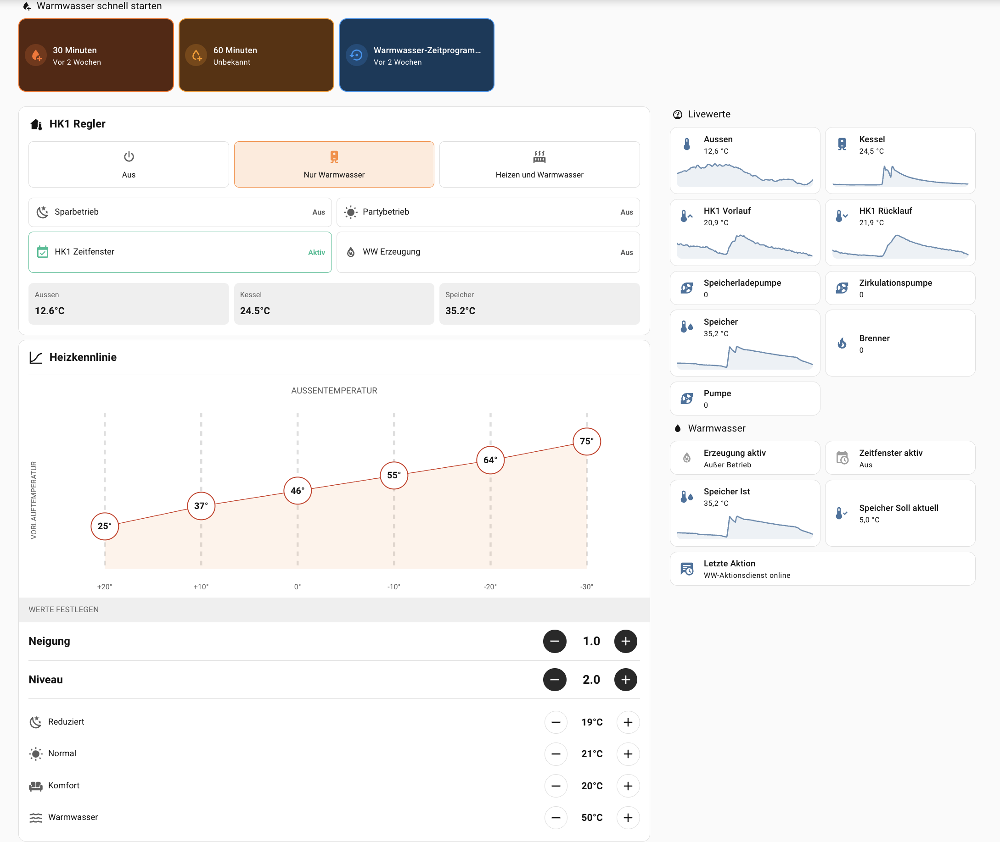
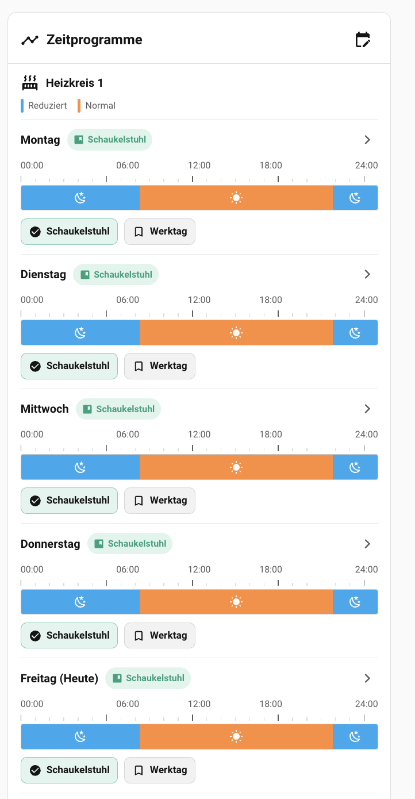
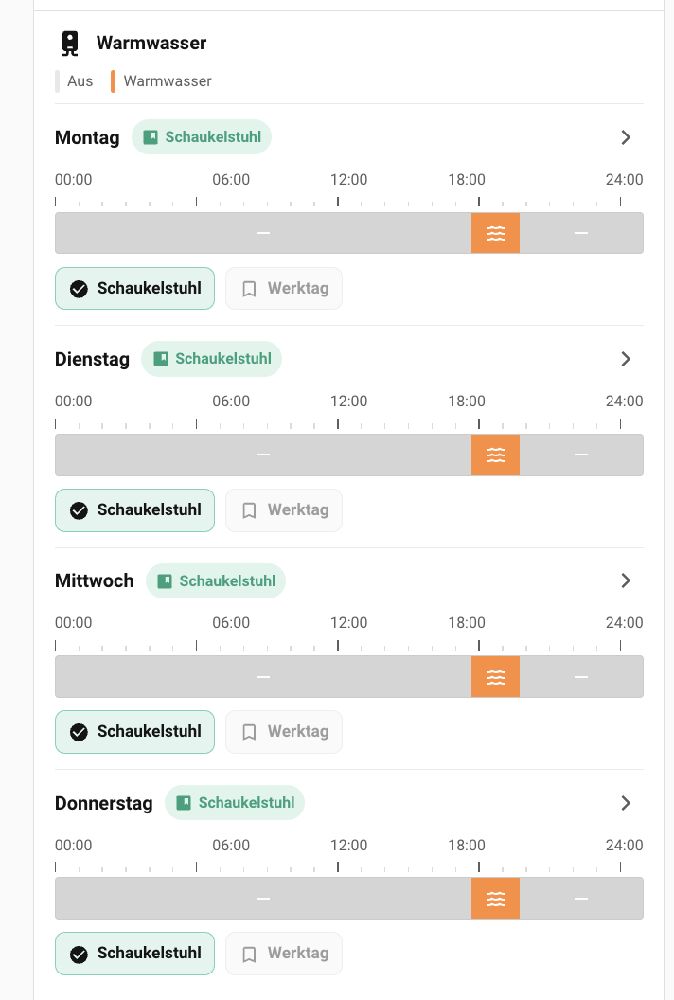
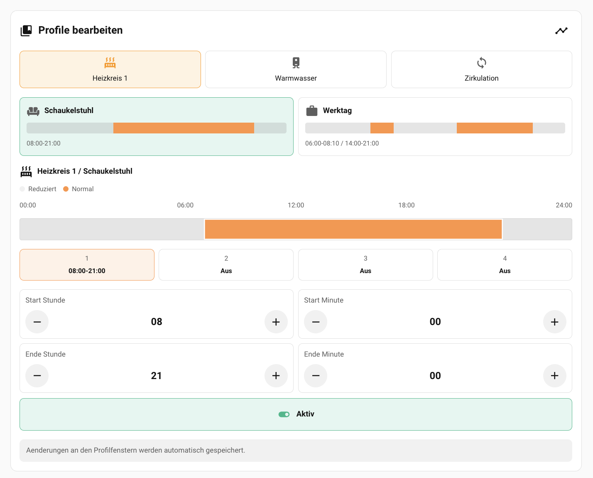

# Vitodens B3HB local control for Home Assistant

Lokale Home-Assistant-Anbindung einer Viessmann Vitodens 300-W B3HB über
[optolink-splitter](https://github.com/philippoo66/optolink-splitter). Die
ViCare-Verbindung kann über den Splitter parallel weiterlaufen.

Lokale Viessmann-Heizungssteuerung mit Home Assistant, MQTT, Optolink,
Vitoconnect und grafischen Lovelace-Karten. Ausgelegt für die Vitodens 300-W
B3HB mit der Gerätekategorie `VScotHO1_72` und dem VS2/P300-Protokoll.



Die vollständige, anonymisierte Konfiguration aller drei Ansichten steht unter
[examples/lovelace-dashboard.yaml](examples/lovelace-dashboard.yaml). Sie
verwendet ausschließlich die durch dieses Projekt angelegten MQTT-Entitäten.

## Besonderheiten

### Zeitprofile statt täglicher Einzelprogrammierung

Für Heizkreis 1, Warmwasserbereitung und Zirkulation lassen sich getrennte
Wochenprofile speichern. Ein vorbereiteter **Werktag** oder **Ruhetag** kann
anschließend mit einem Klick einem beliebigen Wochentag zugewiesen werden. Die
grafische 24-Stunden-Ansicht zeigt direkt, welches Profil und welche Zeitfenster
in der Heizung aktiv sind.

| Heizkreis-Wochenplan | Warmwasser-Wochenplan |
| --- | --- |
|  |  |



### Warmwasser-Schnellstart mit Rückkehr zum Zeitprogramm

Die Warmwasserbereitung kann außerhalb des regulären Zeitprogramms für 30 oder
60 Minuten gestartet werden. Danach stellt der Dienst das zuvor gesicherte
Zeitprogramm wieder her. Home Assistant zeigt dabei getrennt an, ob gerade ein
Warmwasser-Zeitfenster gilt und ob die Speicherladung tatsächlich aktiv ist.

Das Projekt ergänzt den Splitter um:

- MQTT Discovery für Messwerte, Betriebszustände und Zeitprogramme
- lokale Bedienung von Betriebsart, Solltemperaturen, Spar- und Partybetrieb
- temporäre Warmwasserfreigabe für 30 oder 60 Minuten mit Wiederherstellung
- getrennte Wochenprofile für Heizkreis 1, Warmwasser und Zirkulation
- grafische Home-Assistant-Karten für Regelung, Heizkennlinie und Zeitpläne
- Auswertung des Viessmann-Fehlerspeichers mit Klartext und Zeitstempel
- Beispielautomation für Push-Benachrichtigungen bei neuen Störungen
- systemd-Dienst mit automatischem Neustart

## Zusatzfunktionen auf dem Raspberry Pi

Neben dem eigentlichen `optolink-splitter` läuft auf dem Raspberry Pi der
zusätzliche Python-Dienst `vitodens_ww_actions.py`. Er bildet die Logik ab, die
weder die Viessmann-Regelung noch Home Assistant von sich aus bereitstellen:

- Speicherung und Bearbeitung der Profile **Werktag** und **Schaukelstuhl**
- getrennte Profilzuordnung für Heizkreis 1, Warmwasser und Zirkulation
- Anwendung eines Profils auf einzelne Wochentage
- Validierung, Schreiben und anschließendes Zurücklesen der Zeitprogramme
- Warmwasser-Schnellstart für 30 oder 60 Minuten
- Sicherung und Wiederherstellung des vorherigen Warmwasser-Zeitprogramms
- Bedienung von Betriebsart, Solltemperaturen, Spar- und Partybetrieb
- Bedienung von Neigung und Niveau der Heizkennlinie
- Auswertung des Viessmann-Fehlerspeichers mit Klartext und Zeitstempel
- Veröffentlichung zusätzlicher Sensoren und Bedienelemente über MQTT Discovery
- lokale Zustandsdateien für Profile und laufende Warmwasseraktionen

### Datenfluss

```text
Home-Assistant-Karte
        |
        | MQTT-Befehl
        v
vitodens_ww_actions.py auf dem Raspberry Pi
        |
        | lokale TCP-Anfrage
        v
optolink-splitter ---- Optolink ---- Vitodens
        |
        | MQTT-Zustand und MQTT Discovery
        v
Home Assistant
```

Home Assistant sendet Bedienaktionen über eigene MQTT-Befehlsthemen an den
Zusatzdienst. Der Dienst setzt sie in geprüfte Lese- und Schreibbefehle für die
lokale TCP-Schnittstelle des Splitters um. Bestätigte Werte, Aktionsstatus,
Profile und Fehlermeldungen werden anschließend wieder über MQTT veröffentlicht.
Der Dienst wird durch systemd gestartet und bei einem Fehler automatisch neu
gestartet.

## Stand und Kompatibilität

Getestet wurde die Konfiguration mit:

- Vitodens 300-W B3HB
- Gerätekategorie `VScotHO1_72`
- VS2/P300-Protokoll
- Raspberry Pi mit 3,3-V-UART
- USB-Optolink-Adapter
- Vitoconnect über den zweiten seriellen Anschluss des Splitters
- Home Assistant mit MQTT-Integration

Andere Viessmann-Geräte können abweichende Datenpunktadressen, Wertebereiche
oder Betriebsartcodes verwenden. Schreibzugriffe dürfen erst nach dem Vergleich
mit der Serviceunterlage des konkreten Geräts aktiviert werden.

## Aufbau

```text
Vitodens Optolink
       |
USB-Optolink-Adapter
       |
Raspberry Pi + optolink-splitter ---- MQTT ---- Home Assistant
       |
  3,3-V-UART
       |
USB-TTL-Adapter ---- Vitoconnect ---- ViCare
```

Die Anzeige und Bedienoberfläche liegen weitgehend in Home Assistant. Der
Raspberry übernimmt die serielle Kommunikation, MQTT Discovery, abgesicherte
Schreibvorgänge und die Profilverwaltung.

## Schnellstart

1. `optolink-splitter` installieren und die reine Lesefunktion testen.
2. `homeassistant_poll_list.py` in das Splitter-Verzeichnis kopieren.
3. `vitodens_ww_actions.py` ebenfalls in dieses Verzeichnis kopieren.
4. MQTT-Zugang und serielle Ports ausschließlich in der lokalen
   `settings_ini.py` des Splitters konfigurieren.
5. Den Zusatzdienst nach [docs/installation.md](docs/installation.md) einrichten.
6. Die drei JavaScript-Dateien nach `/config/www/` von Home Assistant kopieren
   und als JavaScript-Module registrieren.
7. Das Dashboard aus [examples/lovelace-dashboard.yaml](examples/lovelace-dashboard.yaml)
   über die Home-Assistant-Oberfläche anlegen.
8. Optional die Push-Automation aus
   [examples/fault-notification-automation.yaml](examples/fault-notification-automation.yaml)
   importieren und den Benachrichtigungsdienst anpassen.

Die ausführliche Reihenfolge, Prüfungen und Rückfallmöglichkeiten stehen in
[docs/installation.md](docs/installation.md).

## Dateien

| Datei | Aufgabe |
| --- | --- |
| `homeassistant_poll_list.py` | Datenpunkte und MQTT-Discovery-Metadaten |
| `vitodens_ww_actions.py` | Bedienelemente, Profile, Fehlerspeicher und MQTT-Logik |
| `vitodens_ww_actions.service` | systemd-Dienst |
| `vitodens-heating-control-card.js` | HK1-Regler und Heizkennlinie |
| `vitodens-schedule-bars-card.js` | Wochenübersicht der Zeitprogramme |
| `vitodens-profile-editor-card.js` | Editor für gespeicherte Zeitprofile |

## Sicherheitsmodell

- Neue Datenpunkte zuerst ausschließlich lesen.
- Vor jedem Schreibzugriff Originalwert sichern und danach zurücklesen.
- Zeitprogramme werden als vollständiger Acht-Byte-Block geschrieben und
  unmittelbar verifiziert.
- Es gibt keine automatische Optimierung der Heizkennlinie.
- MQTT und Home Assistant gehören in ein vertrauenswürdiges lokales Netz.
- Keine Passwörter, IP-Adressen oder produktiven Zustandsdateien versionieren.

Dieses Projekt ist kein Produkt von Viessmann und wird von Viessmann weder
unterstützt noch geprüft. Die Nutzung erfolgt auf eigenes Risiko. Arbeiten an
Netzspannung, Gasgerät oder sicherheitsrelevanten Einstellungen gehören in die
Hand einer Fachkraft.

## Dokumentation

- [Installation](docs/installation.md)
- [Bedienkonzept](docs/operation.md)
- [Datenpunkte](docs/datapoints.md)
- [Backup und Wiederherstellung](docs/backup.md)

## Lizenz und Herkunft

Dieses Projekt baut auf dem von
[Phil (`philippoo66`)](https://github.com/philippoo66) entwickelten
[optolink-splitter](https://github.com/philippoo66/optolink-splitter) auf. Ein
ausdrücklicher Dank gilt Phil für seine umfangreiche Arbeit und dafür, die
lokale Anbindung von Viessmann-Heizungen bei gleichzeitigem Weiterbetrieb von
Vitoconnect und ViCare möglich gemacht zu haben.

Der `optolink-splitter` steht unter GPL-3.0. Diese Erweiterung wird deshalb
ebenfalls unter GPL-3.0-or-later veröffentlicht. Viessmann, Vitodens,
Vitoconnect und ViCare sind Marken ihrer jeweiligen Inhaber.
